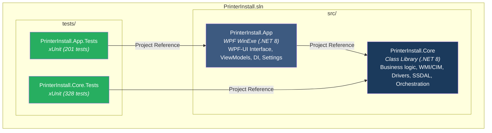

# 🖨️ PrinterInstall

> **Enterprise Desktop Solution for Automated Network Printer and Label Calibration & Deployment.**

> **Languages:** English (this file) · [Português](README.md)

[](https://dotnet.microsoft.com/)
[](https://github.com/lepoco/wpfui)
[](tests/)
[](.github/workflows/release.yml)
[](#-architecture)

---

## 📋 Overview

**PrinterInstall** is a Windows desktop application built with **WPF (.NET 8)** for IT support, infrastructure, and helpdesk teams. It automates and standardizes the entire lifecycle of enterprise printers and thermal label printers across mission-critical environments (hospitals, clinics, multi-branch offices), running local and remote operations via WMI/CIM with secure privilege elevation.

### ✨ Key Features

1. **Batch Deployment (Simultaneous Deploy):**
   - Installs and configures multiple print queues and TCP/IP ports across dozens of workstations at once.
   - Supports workstations by network hostname (`NOTE-XXXXXX`, `113-DESKXXXXXX`) or directly by IP address.
   - Quick *"Add This PC"* button to include the local machine instantly.

2. **Smart Driver Management:**
   - On-demand, transparent extraction of embedded driver packages from the single executable (`EmbeddedDrivers.zip`).
   - Seamless installation via `pnputil.exe` with version fallback (e.g., Lexmark v4 → v2).

3. **Thermal Label Calibration & Configuration (Gainscha):**
   - Full support for **Seagull SSDAL** protocol and **Structured Data Streams (SDS)**.
   - Calibrated presets: `Patient` (89×36mm), `Matrix` (50×30mm), `Wristband` (25×270mm), and `Batch` (45×13mm).

4. **Automatic Rollback & Fault Tolerance:**
   - Transactional journaling (`DeploymentRollbackJournal`): if a machine fails or the user cancels, incomplete ports and queues are automatically undone, leaving the workstation clean.

5. **Printer Control Wizard (Removal & Rename):**
   - Scans remote machines, safely removes orphaned queues with port cleanup, and renames existing queues in batch without reinstalling drivers.

6. **Direct Raw Port 9100 Test Tool:**
   - Tests socket connectivity and prints dedicated test pages/labels (PCL5 for Epson, Brother, Lexmark; TSPL for Gainscha).

7. **Configurable Domain & Network (Run Anywhere):**
   - Easily change the **Default Active Directory Domain** and optional **LDAP Host/Server** before logging in.
   - **Auto-Detect Domain** button to detect the current computer's domain with one click.
   - Settings are stored in `%LocalAppData%\PrinterInstall\settings.json`, persisting across launches even in single-file executable deployments.

8. **Audit & Log Export:**
   - Exports formatted `.txt` diagnostic reports for deployments and printer maintenance.

---

## 🏗️ Architecture



---

## 🖨️ Supported Makers & Models

| Maker | Type | Driver | Presets / Features |
| :--- | :--- | :--- | :--- |
| **Epson** | Inkjet / Laser A4 | EPSON Universal Print Driver | Standard queues, PCL5 test |
| **Brother** | Monochrome Laser | Brother Universal / HL Series | Standard queues, PCL5 test |
| **Lexmark** | Monochrome Laser | Lexmark Universal Print Driver | Fallback v4 → v2, PCL5 test |
| **Gainscha** | Thermal Label | Seagull Scientific Driver (SSDAL) | `Patient`, `Matrix`, `Wristband`, `Batch` |

---

## ⚙️ Domain and Network Configuration

**PrinterInstall** does not hardcode domains or servers:

1. On the login window, click the gear icon (**⚙️**) in the upper right corner.
2. Enter the desired **Default Domain** (e.g., `company.local` or `COMPANY`).
3. Click **"Detect Domain"** to automatically discover the current computer's Active Directory domain.
4. Optionally, enter an **Alternative LDAP Host / Server** if DNS does not resolve directly to the Domain Controller.
5. Click **Save**. Settings are persisted to `%LocalAppData%\PrinterInstall\settings.json`.

---

## 📦 How to Build & Publish (Single Standalone Executable)

The project produces a **single self-contained executable (win-x64)** bundling the .NET 8 runtime, dependencies, and drivers:

```powershell
# Run the publish script
powershell -ExecutionPolicy Bypass -File .\scripts\Publish-PrinterInstall.ps1 -Configuration Release
```

The output executable is created at:
```
publish\PrinterInstall\Printer Install.exe
```

> **Simple Distribution:** Simply copy `Printer Install.exe` to any Windows 10/11 x64 machine. No separate .NET runtime installation required.

---

## 🚀 GitHub Actions Releases (CI/CD)

The repository includes an automated release workflow in [`.github/workflows/release.yml`](.github/workflows/release.yml).

### Publishing a new release via Git Tag:

```bash
# 1. Commit changes
git add .
git commit -m "feat: release v1.0.0"
git push origin main

# 2. Tag and push
git tag v1.0.0
git push origin v1.0.0
```

GitHub Actions will automatically test, compile, package `Printer Install.exe`, and publish the GitHub Release with SHA-256 checksums.

---

## 🧪 Automated Tests

Run the full test suite:

```powershell
dotnet test
```

- **PrinterInstall.Core.Tests:** 328 unit and integration tests.
- **PrinterInstall.App.Tests:** 201 presentation and service tests.
- **Total:** 529 automated tests (100% passing).

---

## 📖 Additional Documentation

- [User Manual (Portuguese)](MANUAL_DO_USUARIO.md) — Comprehensive step-by-step guide with troubleshooting.
- [Plain Text Manual (Portuguese)](MANUAL.txt) — Plaintext manual for quick offline reference.
- [Tested Models List](MODELOS_TESTADOS.txt) — Field-tested printer models.

---

*Engineered for reliability, security, and operational simplicity.*
