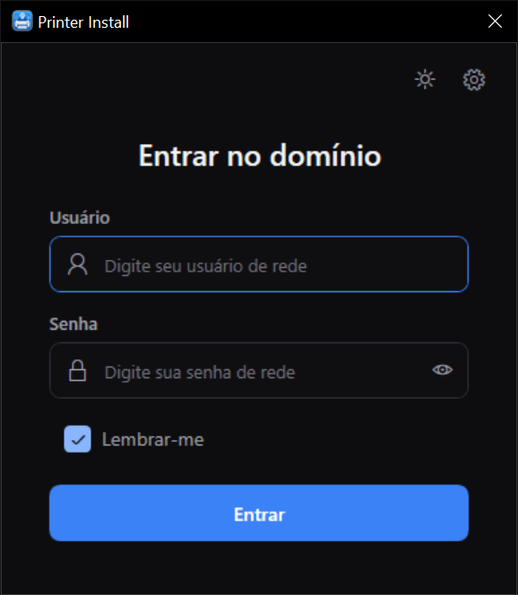
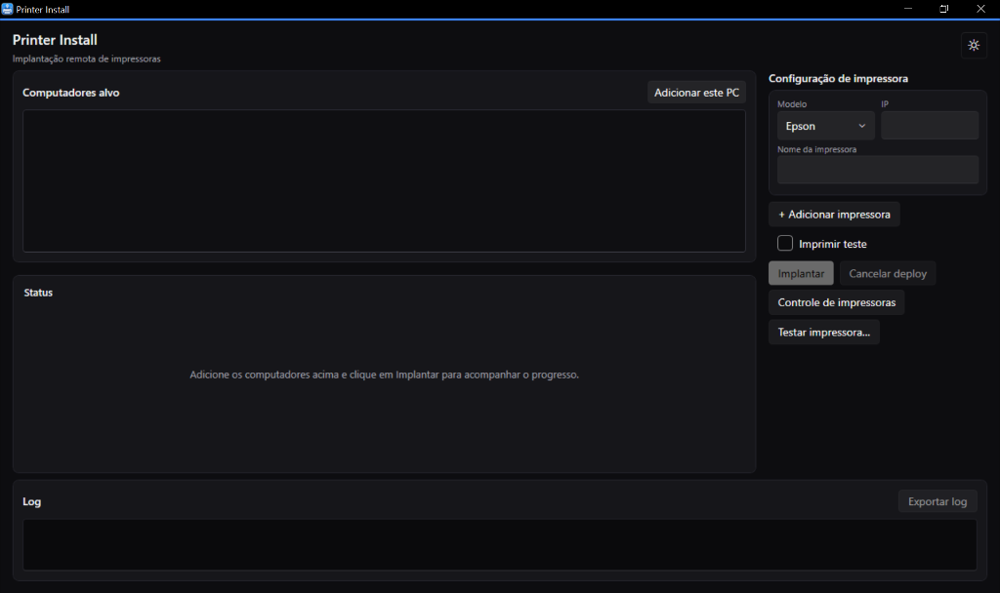

<h1 align="center">PrinterInstall</h1>

<p align="center">
  Aplicativo desktop para Windows voltado à instalação e padronização de impressoras de rede e etiquetadoras térmicas em estações de trabalho.
</p>

<p align="center">
  <strong>Português</strong> · <a href="README.en.md">English</a>
</p>

<p align="center">
  
  &nbsp;
  
</p>

---

## Sobre o projeto

**PrinterInstall** é uma aplicação desktop desenvolvida em .NET 8 e WPF para automatizar a configuração de impressoras de rede em ambientes corporativos e hospitalares. O sistema cria portas TCP/IP, instala drivers de impressão e configura filas em múltiplos computadores de forma remota, eliminando a necessidade de intervenção manual máquina por máquina.

A ferramenta inclui pacotes de drivers para diferentes fabricantes, realiza autenticação no Active Directory via LDAP, calibra etiquetas térmicas Gainscha por meio de fluxos de dados estruturados e desfaz alterações automaticamente caso ocorra alguma falha durante o processo.

---

## Funcionalidades

| Feature | Descrição |
|---|---|
| **Instalação em lote** | Instala filas em vários computadores simultaneamente com acompanhamento de status em tempo real |
| **Reversão automática** | Desfaz filas e portas criadas quando ocorre falha durante a instalação em uma estação |
| **Assistente de controle** | Lista, renomeia e remove filas em computadores remotos ou na máquina local |
| **Teste de comunicação direta** | Valida a conexão e imprime páginas ou etiquetas de teste diretamente pela porta raw 9100 antes da instalação |
| **Presets para Gainscha** | Configura quatro tamanhos predefinidos de etiqueta térmica: Paciente, Matrix, Pulseira e Lote |
| **Autenticação por domínio** | Valida credenciais no Active Directory via LDAP por formatos UPN ou NetBIOS |
| **Configurações personalizáveis** | Permite alterar o domínio padrão e o servidor LDAP na tela de configurações |
| **Elevação de privilégios** | Executa ações administrativas remotas por meio de tarefas agendadas quando necessário |
| **Exportação de relatórios** | Gera arquivos de log estruturados com o resultado de cada operação realizada |

---

## Stack

O projeto utiliza tecnologias nativas da plataforma Windows para gerenciamento de serviços de impressão e rede:

- **.NET 8 (`net8.0-windows`)**: Plataforma principal de execução
- **WPF com WPF-UI**: Interface gráfica construída no padrão Fluent Design do Windows 11
- **CommunityToolkit.Mvvm**: Estrutura MVVM com comandos e propriedades observáveis
- **Microsoft.Extensions.Hosting**: Injeção de dependência e gerenciamento do ciclo de vida da aplicação
- **System.Management**: Consultas e chamadas WMI/CIM para gerenciamento de portas, drivers e filas no spooler do Windows
- **System.DirectoryServices.Protocols**: Comunicação LDAP direta com o Active Directory
- **Seagull SSDAL e SDS**: Protocolo de configuração e calibração de mídia para impressoras térmicas Gainscha
- **xUnit e Moq**: Suíte de testes automatizados para as camadas de domínio e interface

---

## Estrutura do projeto

```
PrinterInstall/
├── docs/
│   └── screenshots/                    # Capturas de tela da aplicação
├── drivers/
│   ├── Brother/                        # Pacotes de driver para impressoras Brother
│   ├── Epson/                          # Pacotes de driver EPSON Universal Print Driver
│   ├── Gainscha/                       # Drivers e utilitários da impressora térmica Gainscha
│   └── Lexmark/                        # Drivers Lexmark Universal v4 e v2
├── publish/                            # Diretório de saída do binário compilado
├── scripts/
│   ├── Capture-GainschaLabelPreset.ps1 # Captura perfis de calibração SDS de etiquetas
│   ├── Publish-PrinterInstall.ps1      # Compilação e publicação do executável único
│   └── Test-GainschaAddType.ps1        # Teste de importação de tipos C# no PowerShell
├── src/
│   ├── PrinterInstall.App/             # Interface gráfica WPF
│   │   ├── Assets/                     # Ícones, imagens e recursos visuais
│   │   ├── Converters/                 # Conversores de valor XAML
│   │   ├── Localization/               # Suporte a textos e idiomas da UI
│   │   ├── Services/                   # Serviços de UI, diálogo, sessão e exportação de logs
│   │   ├── ViewModels/                 # Lógica de apresentação MVVM
│   │   ├── Views/                      # Telas e janelas da aplicação
│   │   ├── App.xaml                    # Configuração global de recursos e estilos
│   │   ├── App.xaml.cs                 # Ponto de entrada e container de injeção de dependência
│   │   └── appsettings.json            # Configurações de domínio e servidor LDAP
│   └── PrinterInstall.Core/            # Camada de lógica e domínio
│       ├── Auth/                       # Autenticação LDAP e validação de credenciais
│       ├── Catalog/                    # Catálogo e mapeamento de modelos e drivers
│       ├── Drivers/                    # Extração de pacotes e instalação via pnputil
│       ├── Gainscha/                   # Comunicação SSDAL, SDS e calibração de mídia
│       ├── Logging/                    # Registro estruturado de eventos de execução
│       ├── Models/                     # Modelos de domínio, records e enums de estado
│       ├── Network/                    # Testes de porta raw 9100 e envio de comandos de teste
│       ├── Orchestration/              # Orquestrador de deploy e diário de rollback
│       ├── Remote/                     # Operações CIM/WMI remotas e escalação de privilégios
│       └── Validation/                 # Validações de entrada de dados e rede
├── tests/
│   ├── PrinterInstall.App.Tests/       # Testes unitários de ViewModels e serviços de UI
│   └── PrinterInstall.Core.Tests/      # Testes unitários de regras de domínio, catálogo e orquestração
├── GEMINI.md                           # Diretrizes de desenvolvimento e documentação técnica
├── LICENSE                             # Termos da licença MIT
├── MANUAL.txt                          # Manual com instruções de operação
├── MODELOS_TESTADOS.txt                # Lista de impressoras e modelos validados
├── PrinterInstall.sln                  # Arquivo da solução .NET
└── README.md                           # Este arquivo
```

---

## Arquitetura

A solução é organizada em duas camadas principais, acompanhadas por seus respectivos projetos de teste:

1. **PrinterInstall.Core**: Biblioteca de classes independente de interface gráfica. Reúne o catálogo de equipamentos, lógica de validação, autenticação LDAP, orquestração de deploy, comunicação raw com impressoras e operações remotas via WMI/CIM.
2. **PrinterInstall.App**: Aplicação cliente em WPF que implementa o padrão MVVM com a biblioteca WPF-UI. Gerencia a navegação entre telas, captura de entradas do operador, feedback visual em tempo real e exportação de relatórios.

Operações que criam recursos no sistema registram suas ações no diário de reversão (`DeploymentRollbackJournal`). Em caso de cancelamento ou falha no meio do processo, o orquestrador desfaz as etapas concluídas e remove portas ou filas parciais. As chamadas locais e remotas passam pelo roteador `RoutingRemotePrinterOperations`, que seleciona a forma de execução adequada para cada computador de destino.

---

## Presets de etiquetas Gainscha

| Preset | Dimensões | Uso no ambiente hospitalar |
|---|:---:|---|
| **Paciente** | 89 × 36 mm | Fichas de identificação, prontuários e leitos |
| **Matrix** | 50 × 30 mm | Tubos de coleta laboratorial e frascos de exame |
| **Pulseira** | 25 × 270 mm | Pulseiras de identificação hospitalar do paciente |
| **Lote** | 45 × 13 mm | Identificação de medicamentos e almoxarifado |

Antes de instalar uma fila Gainscha, confirme o rolo instalado na impressora física. A escolha de um preset maior do que o papel carregado fará a impressão ultrapassar as margens da etiqueta.

---

## Como compilar e executar

### Pré-requisitos

- [.NET 8 SDK](https://dotnet.microsoft.com/download/dotnet/8.0)
- Sistema operacional Windows 10, Windows 11 ou Windows Server
- Credenciais com privilégios administrativos para operações remotas

### Passo a passo

1. **Clone o repositório:**
   ```powershell
   git clone https://github.com/brendonpereiradev/PrinterInstall
   cd PrinterInstall
   ```

2. **Compile a solução:**
   ```powershell
   dotnet build PrinterInstall.sln
   ```

3. **Execute a aplicação:**
   ```powershell
   dotnet run --project src/PrinterInstall.App
   ```

### Comandos disponíveis

| Comando | Descrição |
|---|---|
| `dotnet build PrinterInstall.sln` | Compila todos os projetos da solução |
| `dotnet run --project src/PrinterInstall.App` | Inicia o aplicativo WPF em modo de desenvolvimento |
| `dotnet test PrinterInstall.sln` | Executa todos os testes unitários |
| `pwsh scripts/Publish-PrinterInstall.ps1` | Gera o executável único autocontido na pasta `publish/PrinterInstall` |

---

## Fluxo de uso

1. **Autenticação:** Informe suas credenciais de rede no formato `usuario@dominio` ou `DOMINIO\usuario`. Se precisar alterar o domínio ou servidor LDAP padrão, clique no ícone de configurações no cabeçalho. As credenciais permanecem ativas apenas durante a sessão do aplicativo.
2. **Seleção de computadores:** Adicione os computadores alvo pelo nome de rede ou endereço IP. O botão "Adicionar Este PC" inclui a máquina local. Você também pode colar uma lista de computadores de uma vez.
3. **Configuração de filas:** Escolha o fabricante, informe o IP da impressora e defina o nome da fila. Para impressoras térmicas Gainscha, selecione o preset de etiqueta correspondente.
4. **Execução do deploy:** Inicie a instalação e acompanhe o status de cada máquina. Ao finalizar, exporte o relatório das operações em arquivo de texto.

---

## Documentação

- [Manual de Operação](MANUAL.txt): Guia com procedimentos de suporte, telas e resolução de problemas comuns
- [Modelos testados](MODELOS_TESTADOS.txt): Relação de equipamentos e drivers validados por fabricante
- [GEMINI.md](GEMINI.md): Diretrizes de desenvolvimento e referências de arquitetura

---

## Licença e termos

Distribuído sob a licença **MIT**. Consulte o arquivo [`LICENSE`](LICENSE) para mais detalhes.

> **Nota:** Os drivers de impressão e utilitários de terceiros inclusos pertencem aos seus respectivos fabricantes e estão sujeitos aos seus próprios termos de licenciamento.

