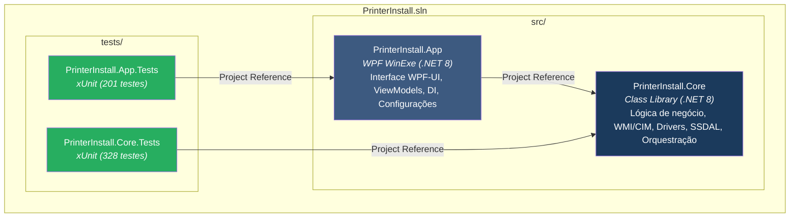

# 🖨️ PrinterInstall

> **Solução Desktop Corporativa para Implantação, Gestão e Calibração Automatizada de Impressoras de Rede e Etiquetadoras.**

> **Idiomas:** Português (este arquivo) · [English](README.en.md)

[](https://dotnet.microsoft.com/)
[](https://github.com/lepoco/wpfui)
[](tests/)
[](.github/workflows/release.yml)
[](#-arquitetura)

---

## 📋 Visão Geral

O **PrinterInstall** é uma aplicação desktop desenvolvida em **WPF (.NET 8)** voltada para equipes de suporte, infraestrutura e helpdesk. Ela automatiza e padroniza todo o ciclo de vida de impressoras corporativas e térmicas em ambientes de missão crítica (como hospitais, clínicas e escritórios), executando operações locais e remotas via WMI/CIM com escalação segura de privilégios.

### ✨ Principais Funcionalidades

1. **Implantação em Lote (Deploy Simultâneo):**
   - Instalação e configuração de múltiplas filas e portas TCP/IP em dezenas de computadores simultaneamente.
   - Suporte a computadores por nome de rede (`NOTE-XXXXXX`, `113-DESKXXXXXX`) ou diretamente por endereço IP.
   - Botão rápido para adicionar a máquina local (*"Este PC"*).

2. **Gerenciamento Inteligente de Drivers:**
   - Extração transparente e sob demanda de pacotes de drivers embutidos no executável único (`EmbeddedDrivers.zip`).
   - Instalação via `pnputil.exe` com resolução e fallback inteligente entre versões de drivers (ex: Lexmark v4 → v2).

3. **Configuração e Calibração de Etiquetas Térmicas (Gainscha):**
   - Suporte completo ao protocolo **Seagull SSDAL** e streams **SDS (Structured Data Streams)**.
   - Presets calibrados: `Paciente` (89x36mm), `Matrix` (50x30mm), `Pulseira` (25x270mm) e `Lote` (45x13mm).

4. **Rollback Automático e Tolerância a Falhas:**
   - Journaling transacional (`DeploymentRollbackJournal`): se a instalação for interrompida ou falhar, portas e filas incompletas são revertidas automaticamente, evitando estados inconsistentes no Windows.

5. **Assistente de Controle de Impressoras (Remoção e Renomeação):**
   - Varredura remota de filas instaladas, exclusão segura de filas órfãs com limpeza de portas de rede e renomeação em lote.

6. **Ferramenta de Teste de Rede Direto:**
   - Validação de socket raw (porta 9100) e envio de páginas de teste dedicadas (PCL5 para Epson, Brother e Lexmark; TSPL para Gainscha).

7. **Configurações Dinâmicas de Domínio e Rede:**
   - Modal dedicado para alterar o **Domínio Padrão** e o **Host LDAP**, permitindo que a aplicação rode em qualquer rede ou floresta corporativa.
   - Botão de **Detecção Automática de Domínio** da máquina local.
   - Persistência das preferências em `%LocalAppData%\PrinterInstall\settings.json`.

8. **Exportação de Relatórios e Auditoria:**
   - Geração de relatórios estruturados em `.txt` com logs detalhados de deploy e controle.

---

## 🏗️ Arquitetura



---

## 🖨️ Fabricantes e Modelos Suportados

| Fabricante | Tipo | Driver Utilizado | Presets / Recursos |
| :--- | :--- | :--- | :--- |
| **Epson** | Jato de Tinta / Laser A4 | EPSON Universal Print Driver | Filas padrão, teste PCL5 |
| **Brother** | Laser Monocromática | Brother Universal / HL Series | Filas padrão, teste PCL5 |
| **Lexmark** | Laser Monocromática | Lexmark Universal Print Driver | Fallback v4 → v2, teste PCL5 |
| **Gainscha** | Térmica de Etiquetas | Seagull Scientific Driver (SSDAL) | `Paciente`, `Matrix`, `Pulseira`, `Lote` |

---

## ⚙️ Configuração de Domínio e Rede

O **PrinterInstall** não possui domínios ou servidores fixos em código compilado:

1. Na tela de login, clique no ícone de engrenagem (⚙️) no canto superior direito.
2. Defina o **Domínio Padrão** desejado (ex: `empresa.local` ou `EMPRESA`).
3. Utilize o botão **"Detectar Domínio"** para preencher automaticamente com o domínio atual da estação.
4. Opcionalmente, informe um **Servidor / Host LDAP Alternativo** se o DNS não resolver diretamente o controlador de domínio.
5. Clique em **Salvar**. As configurações são persistidas em `%LocalAppData%\PrinterInstall\settings.json`.

---

## 📦 Como Compilar e Publicar (Executável Único)

A aplicação é compilada como um **executável único autocontido (Self-Contained Single-File win-x64)** com todos os drivers e o .NET Runtime embutidos:

```powershell
# Executar script de publicação
powershell -ExecutionPolicy Bypass -File .\scripts\Publish-PrinterInstall.ps1 -Configuration Release
```

O binário final será gerado em:
```
publish\PrinterInstall\Printer Install.exe
```

> **Distribuição simples:** Basta copiar o arquivo `Printer Install.exe` para qualquer computador com Windows 10/11 x64. Não requer instalação prévia do .NET Runtime nem arquivos adicionais.

---

## 🚀 Publicação Automática de Releases (GitHub Actions)

O repositório conta com uma pipeline de CI/CD automatizada em [`.github/workflows/release.yml`](.github/workflows/release.yml).

### Criando uma nova Release via Git:

```bash
# 1. Commitar suas alterações
git add .
git commit -m "feat: release v1.0.0"
git push origin main

# 2. Criar e enviar a tag de versão
git tag v1.0.0
git push origin v1.0.0
```

O GitHub Actions irá automaticamente:
1. Compilar o projeto em ambiente limpo Windows.
2. Executar a suíte de 529 testes automatizados.
3. Gerar o executável único `Printer Install.exe`.
4. Criar a Release no GitHub anexando o executável e a lista de checksums SHA-256.

---

## 🧪 Testes Automatizados

Para executar todos os testes da solução:

```powershell
dotnet test
```

- **PrinterInstall.Core.Tests:** 328 testes unitários e de integração.
- **PrinterInstall.App.Tests:** 201 testes de apresentação e serviços.
- **Total:** 529 testes com 100% de aprovação.

---

## 📖 Documentação Adicional

- [Manual do Usuário (Markdown)](MANUAL_DO_USUARIO.md) — Guia passo a passo com capturas conceituais e instruções detalhadas.
- [Manual em Texto Simples](MANUAL.txt) — Manual em formato texto puro para distribuição rápida.
- [Modelos Testados](MODELOS_TESTADOS.txt) — Lista de modelos homologados em campo.

---

*Desenvolvido com foco em alta confiabilidade, segurança e eficiência operacional.*
